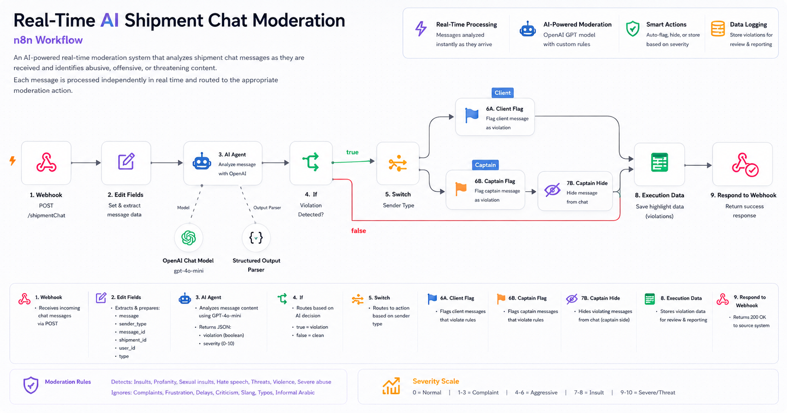

# 🚚 Real-Time AI Shipment Chat Moderation

### n8n Workflow

An AI-powered real-time moderation system built with **n8n and OpenAI** to analyze shipment chat messages as they are received and automatically detect abusive, offensive, or threatening content.

The system processes **each incoming message independently in real time** without waiting for the conversation to end.

---

## 📌 Overview

Shipment conversations may contain inappropriate, abusive, or threatening messages that require immediate intervention.

Manual monitoring can be difficult to scale and may lead to delayed responses or inconsistent moderation decisions.

This workflow automates the moderation process by analyzing every incoming shipment chat message instantly and triggering the appropriate action based on:

- Whether a violation was detected
- The sender type
- The severity of the violation

---

## 🔄 Workflow

<p align="center">
  
</p>

---

## 🎯 Problem

In a shipment communication environment, messages are continuously exchanged between customers and captains.

A moderation system needs to:

- Analyze messages immediately as they arrive
- Detect abusive or inappropriate content
- Distinguish between customers and captains
- Apply different moderation actions depending on the sender
- Store important moderation data
- Avoid waiting for the entire conversation to finish

---

## 💡 Solution

The workflow receives each incoming message through a webhook and sends it to an AI moderation layer.

The AI evaluates the message against predefined moderation rules and returns a structured result.

Based on the result, the workflow automatically routes the message to the correct moderation action.

### Message-Level Processing

Each message is processed independently:

```text
Incoming Message
      ↓
   AI Analysis
      ↓
Violation Detected?
   ↙          ↘
 FALSE        TRUE
  ↓             ↓
Execution     Sender Type
  Data        ↙         ↘
           Client      Captain
             ↓            ↓
        Client Flag   Captain Flag
             ↓            ↓
        Execution    Captain Hide
           Data          ↓
                    Execution Data
                           ↓
                   Webhook Response
