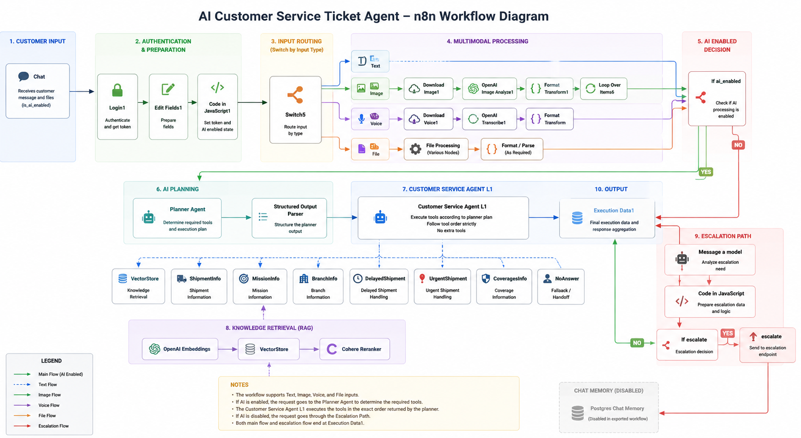

# AI Customer Service Ticket Agent

An AI-powered customer service ticket processing workflow built with n8n.

The workflow is designed to process customer requests across multiple
input types, determine the required tools through an AI Planner, execute
those tools through a controlled Customer Service Agent, retrieve
knowledge when required, and handle escalation scenarios.

---

## Overview

The workflow processes customer service requests through several stages:

- Authentication and request preparation
- Input type routing
- Multimodal processing
- AI-enabled decision making
- AI tool planning
- Controlled tool execution
- Knowledge retrieval
- Escalation handling
- Execution data processing

Supported input types include:

- Text
- Image
- Voice
- File

---

## Workflow Architecture



The detailed architecture documentation is available in:

[`docs/architecture.md`](docs/architecture.md)

---

## How It Works

### 1. Customer Input

The workflow starts from the `Chat` node, which receives the customer
request and related ticket information.

---

### 2. Authentication & Preparation

The request passes through the authentication and preparation flow:

```text
Chat
 ↓
Login1
 ↓
Edit Fields1
 ↓
Code in JavaScript1
 ↓
Switch5
