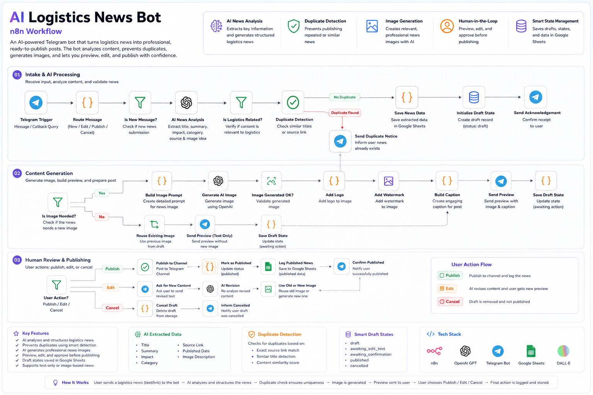

# 🚚 AI Logistics News Bot

### n8n Workflow

An AI-powered Telegram bot for creating, reviewing, editing, and publishing logistics news.

The system automates the complete news publishing lifecycle — from receiving a news submission and generating a structured draft to detecting duplicates, generating or reusing an image, previewing the final post, and publishing it to a Telegram channel.

---

## 📌 Overview

The AI Logistics News Bot is designed to simplify and standardize the process of preparing logistics-related news for publication.

Instead of manually writing, formatting, checking, designing, and publishing every post, the bot provides an interactive workflow that keeps the user in control while automating the repetitive parts of the process.

The workflow supports:

- 📝 Creating new logistics news
- ✏️ Editing and revising existing drafts
- 🔍 Validating submitted information
- ♻️ Detecting duplicate or similar news
- 🖼️ Generating suitable news images
- ♻️ Reusing existing images when appropriate
- 💧 Applying branding and watermarking
- 👀 Previewing the final post
- 🚀 Publishing approved news to Telegram
- ❌ Cancelling an active draft
- 💾 Maintaining draft and publishing state

---

## 🔄 Workflow



---

## 🎯 Problem

Publishing logistics news manually involves several repetitive steps:

- Collecting and reviewing the news
- Writing and formatting the content
- Checking whether enough information is available
- Verifying that the topic is relevant to logistics
- Checking for duplicate stories
- Creating a suitable visual
- Applying branding
- Reviewing the final post
- Publishing it to the Telegram channel

When these steps are performed manually, the process can become time-consuming and inconsistent.

The goal of this workflow is to automate the operational work while keeping the final publishing decision under human control.

---

## 💡 Solution

The workflow combines Telegram, n8n, AI processing, image generation, and state management into one interactive publishing system.

Each news item follows a controlled lifecycle:

```text
Telegram Input
      ↓
Message Routing
      ↓
Create / Edit / Publish / Cancel
      ↓
AI News Analysis
      ↓
Content Validation
      ↓
Duplicate Detection
      ↓
Draft State
      ↓
Image Generation / Reuse
      ↓
Preview
      ↓
Edit / Cancel / Publish
      ↓
Telegram Channel
