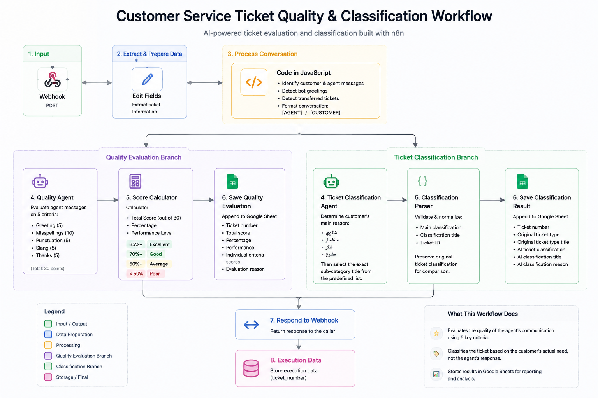

# Customer Service Ticket Quality & Classification

AI-powered customer service ticket evaluation and classification workflow
built with n8n.

The workflow processes customer service tickets through two parallel AI
pipelines:

- Customer Service Quality Evaluation
- Customer Ticket Classification

Both pipelines process the same ticket conversation and store their results
for reporting and analysis.

---

## Workflow



---

## Overview

The workflow receives customer service ticket data through a webhook,
extracts and prepares the ticket information, processes the conversation,
and sends it to two independent AI agents.

### Quality Evaluation

Evaluates the customer service agent's communication across five criteria:

- Greeting
- Misspellings
- Punctuation
- Slang
- Thanks

The evaluation is converted into a numerical score and stored in Google
Sheets.

### Ticket Classification

Determines the customer's actual reason for contacting customer service.

The AI classifies the ticket into one of the supported main categories:

- شكوى
- استفسار
- شكر
- مقترح

It then selects the appropriate sub-category from the predefined
classification list.

---

## Architecture

```text
Webhook
   ↓
Edit Fields
   ↓
Code in JavaScript
   ├──────────────────────────────┐
   ↓                              ↓
Quality Agent          Ticket Classification Agent
   ↓                              ↓
Score Calculator       Classification Parser
   ↓                              ↓
Google Sheets          Google Sheets
   └──────────────┬───────────────┘
                  ↓
          Respond to Webhook
                  ↓
           Execution Data
