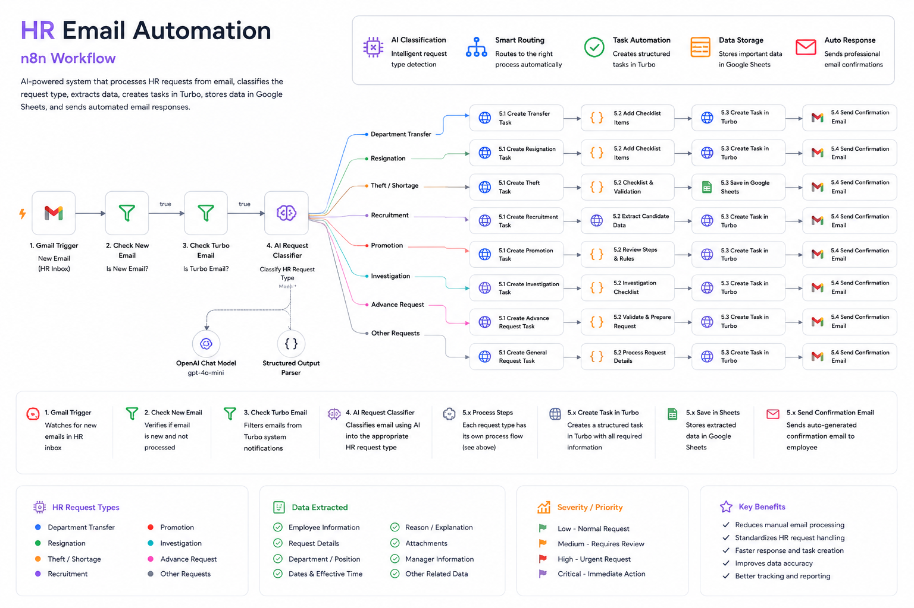

# 📧 HR Email Automation

### n8n Workflow

An AI-powered HR email processing workflow built with **n8n, Gmail, OpenAI, Google Sheets, and Turbo**.

The system monitors incoming HR emails, validates and classifies requests using AI, routes them to the appropriate automated HR process, creates structured tasks, generates standardized responses, and stores selected structured data for reporting.

---

## 📌 Overview

HR teams receive different types of requests through email, often containing unstructured information that requires manual review, classification, data extraction, task creation, and follow-up.

This automation transforms the email-based process into a structured workflow by:

- 📥 Monitoring incoming HR emails
- 🔍 Identifying new HR requests
- 🛡️ Filtering relevant Turbo-related emails
- 🤖 Classifying requests using AI
- 📋 Extracting structured information
- 🔀 Routing requests to the appropriate HR process
- 📝 Creating tasks in the Turbo platform
- ☑️ Creating process-specific checklists
- 📊 Storing selected structured data in Google Sheets
- ✉️ Generating standardized email responses
- 🌍 Supporting Arabic and English email responses

---

## 🔄 Workflow



---

## 🎯 Problem

Processing HR requests manually can lead to:

- Repetitive administrative work
- Inconsistent request classification
- Delayed task creation
- Manual data extraction
- Inconsistent communication
- Difficulty tracking different HR request types
- Repeated manual checklist preparation

The automation reduces these manual steps and standardizes the processing of HR requests.

---

## 💡 Solution

The workflow acts as an AI-powered processing layer between the HR mailbox and internal operational systems.

Each incoming request follows a controlled pipeline:

```text
Incoming HR Email
        ↓
New Email Validation
        ↓
Turbo Email Validation
        ↓
AI Classification
        ↓
Request-Specific Routing
        ↓
Data Extraction
        ↓
Turbo Task Creation
        ↓
Process Checklists
        ↓
Email Response Generation
        ↓
Confirmation Email
