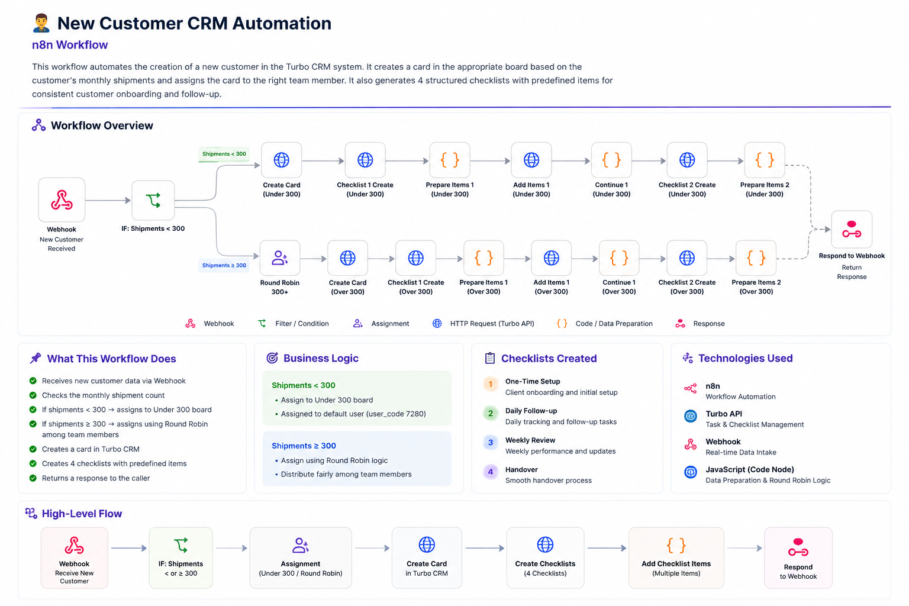

# 👤 New Customer CRM Automation

### n8n Workflow

An automated customer onboarding workflow built with **n8n and Turbo APIs**.

The workflow receives a new customer through a webhook, evaluates the customer's monthly shipment volume, assigns the customer to the appropriate CRM workflow, creates a customer card, and automatically generates structured checklists for onboarding and follow-up.

---

## 🔄 Workflow

<p align="center">
  
</p>

---

## 📌 Overview

The workflow automates the process of registering a new customer in the Turbo CRM system.

Instead of manually creating customer cards and preparing operational checklists, the workflow handles the process automatically based on the customer's monthly shipment volume.

The workflow performs:

- 📥 Receiving new customer data through a webhook
- 📊 Checking the customer's monthly shipment count
- 🔀 Routing the customer based on shipment volume
- 👥 Assigning customers to the appropriate team member
- 🗂️ Creating a customer card in Turbo
- ☑️ Creating structured process checklists
- 📝 Adding predefined checklist items
- 📤 Returning a response to the webhook caller

---

## 🎯 Problem

Adding and onboarding new customers manually can require several repetitive operational steps.

The process may involve:

- Reviewing customer information
- Checking monthly shipment volume
- Determining the appropriate customer segment
- Assigning the customer to a team member
- Creating a CRM card
- Preparing multiple checklists
- Adding checklist items manually

Repeating these steps manually can introduce inconsistency and unnecessary operational work.

---

## 💡 Solution

The workflow turns the customer onboarding process into an automated pipeline.

```text
New Customer
      ↓
Webhook
      ↓
Check Monthly Shipments
      ↓
┌───────────────────────┐
│                       │
│   < 300      ≥ 300    │
│      ↓          ↓     │
│  Under 300    Round   │
│    Board      Robin   │
│                 ↓     │
└──────────┬────────────┘
           ↓
      Create CRM Card
           ↓
    Create Checklists
           ↓
     Add Checklist Items
           ↓
      Webhook Response
